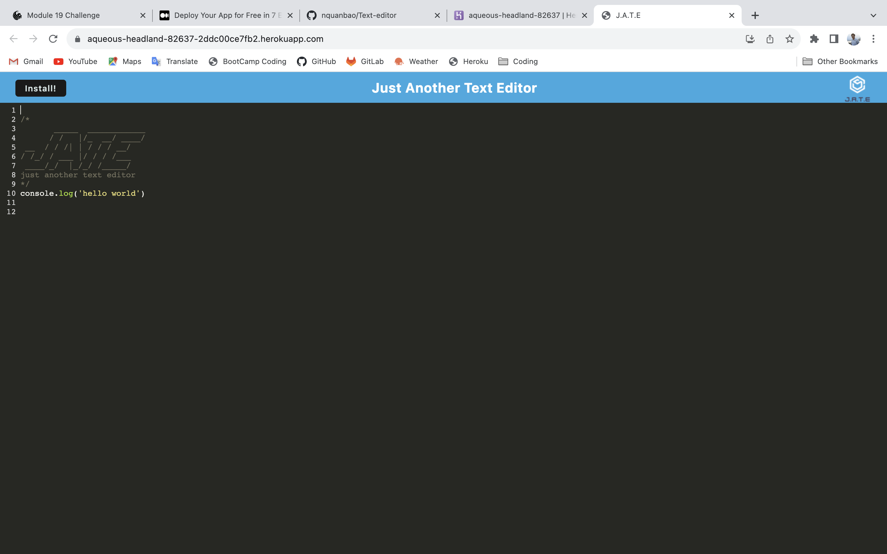

# Text Editor     

## Description

- What was your motivation?
    
    To build a text editor that runs in the browser. The app will be a single-page application that meets the PWA criteria.
    This app also creates notes or code snippets with or without an internet connection so I can reliably retrieve them for later use

- Why did you build this project? (Note: the answer is not "Because it was a homework assignment.")
    
    For weekly assignment

- What did you learn?
    
    learn more about PWA, such as webpack, running client and server same time, and also learn more some window DOM like service worker, manifest and IndexDB

## Table of Contents:

- [Installation](#installation)
- [Usage](#usage)
- [License](#license)
- [Contributing](#how-to-contribute)
- [Test](#tests)
- [Questions](#questions)

## Installation

    Creat a repo on GitHub and clone it to local computer. Coding for Shape.js, text.js, and index.js. Run the indexsx.js to create a svg file by tthe command line is node index.js

## Usage

[link to deployed Heroku](https://aqueous-headland-82637-2ddc00ce7fb2.herokuapp.com/)

## License

The last section of a high-quality README file is the license. This lets other developers know what they can and cannot do with your project. If you need help choosing a license, refer to [https://choosealicense.com/](https://choosealicense.com/).

[MIT License](https://choosealicense.com/licenses/mit/)
    
    A short and simple permissive license with conditions only requiring preservation of copyright and license notices. Licensed works, modifications, and larger works may be distributed under different terms and without source code.    

## Contributing
    Tried to work on browser or install the app on local computer

## Tests
    run npm run start to test the app

## Questions

- My GitHub: [nquanbao](https://github.com/nquanbao)

- If you have any question or need to report any issues about the application, please contact me by e-mail.

- My e-mail address : [nqbaocmc@gmail.com](nqbaocmc@gmail.com)
